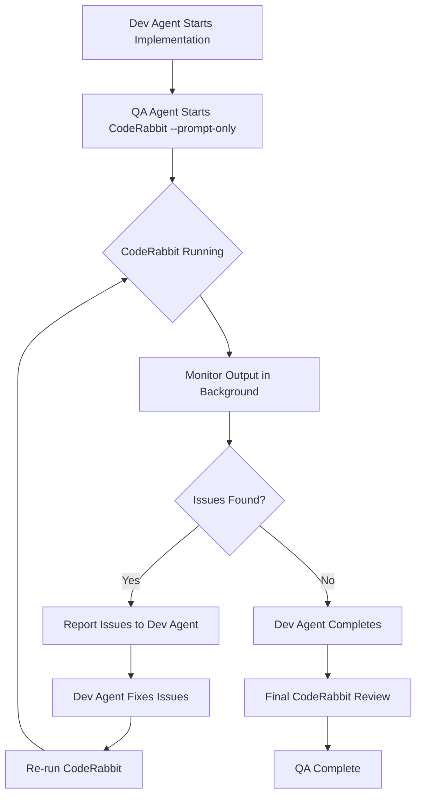

# Testing Patterns Reference

Reference documentation for systematic quality assurance across multiple application modalities. Use this during Phase 8 (Execution & QA) of the super-dev workflow.

## Core Principles

### Specification-First Testing
Derive all test plans and cases from requirements and acceptance criteria—no testing without documented specifications.

### Deterministic Execution
Ensure reproducible test execution with isolated environments, stable data, and trace recording.

### Clear Oracles
Use explicit assertions: values, diffs, screenshots, accessibility/performance budgets.

### Actionable Feedback
Include evidence, reproduction steps, and expected vs actual for all defects.

### Modality-Aware Testing
Apply quality gates consistently across CLI, Desktop UI, and Web applications.

## Test Planning

### Test Plan Structure

```markdown
# Test Plan: [Feature/Application Name]

## Test Summary
- **Application**: [Name]
- **Modality**: CLI | Desktop UI | Web App
- **Version**: [version]
- **Date**: [timestamp]

## Test Strategy
### Risk Assessment
| Risk Area | Probability | Impact | Mitigation |
|-----------|-------------|--------|------------|
| [area] | High/Med/Low | High/Med/Low | [strategy] |

### Coverage Targets
- [ ] Happy path scenarios
- [ ] Boundary conditions
- [ ] Error handling
- [ ] Edge cases
- [ ] Security validations
- [ ] Accessibility compliance

## Test Cases
### TC-001: [Test Name]
- **Priority**: P0/P1/P2
- **Preconditions**: [setup required]
- **Steps**:
  1. [action]
  2. [action]
- **Expected Result**: [oracle]
- **Validation Type**: [assertion|screenshot|diff|hash]
```

### Test Authoring Strategy

**Unit Tests**: Cover core logic, edge/boundary conditions
- Test individual functions in isolation
- Mock external dependencies
- Verify error handling paths

**Integration Tests**: Verify component interactions
- Test API endpoints with real database
- Verify data flow between components
- Test transaction boundaries

**Coverage Targets**:
- Overall coverage: ≥ 80%
- New/changed code: ≥ 90%
- Critical paths: 100%

## Execution Flow

```
1. Receive DEV_COMPLETE with files_changed
2. Author/update unit/integration tests for changed code and impacted areas
3. Build & Run:
   - Rust/Go: request build slot, then `cargo test` / `go test ./...`
   - JS/Python: run `npm|pnpm test` / `pytest` concurrently
4. Report:
   - Status: pass/fail, failing tests (name, error)
   - Coverage: overall and new/changed code delta
5. Handle Failures (max 3 attempts):
   - Classify: code bug → notify dev; test bug → fix tests; flaky → stabilize; env → document/workaround
   - If unresolved → emit TEST_BLOCKED with evidence
```

## CLI Testing Patterns

### Command Enumeration

```bash
# Parse help output to discover all commands and flags
<app> --help
<app> <subcommand> --help
man <app>  # If available

# Extract:
# - All subcommands
# - All flags (short and long forms)
# - Required vs optional arguments
# - Default values
# - Environment variables
```

### Value Matrix Generation

Create test matrices for each command:

| Parameter | Valid Values | Boundary Values | Malformed Values |
|-----------|--------------|-----------------|------------------|
| `--count` | 1, 100, 1000 | 0, MAX_INT | -1, "abc", null |
| `--file` | existing.txt | empty.txt, large.txt | missing.txt, /dev/null |
| `--format` | json, yaml | (none) | invalid, "" |

### Sandbox Execution

```bash
# Create isolated test environment
SANDBOX_DIR=$(mktemp -d)
cd "$SANDBOX_DIR"

# Setup test fixtures
cp -r /path/to/fixtures/* .

# Execute test
timeout 30s <app> <args> > stdout.txt 2> stderr.txt
EXIT_CODE=$?

# Cleanup
cd - && rm -rf "$SANDBOX_DIR"
```

### Assertion Framework

**Exit Code Assertions:**

| Scenario | Expected Exit Code |
|----------|-------------------|
| Success | 0 |
| Invalid args | 1 |
| File not found | 2 |
| Permission denied | 126 |
| Command not found | 127 |
| Timeout | 124 |

**stdout Regex Assertions:**
```bash
# Verify output format
grep -E "^SUCCESS:" stdout.txt
grep -E "^[0-9]{4}-[0-9]{2}-[0-9]{2}" stdout.txt  # Date format

# Verify JSON output
jq -e '.status == "ok"' stdout.txt
```

**stderr Trap Assertions:**
```bash
# Verify error messages are meaningful
grep -E "Error:|Warning:|Fatal:" stderr.txt

# Ensure no stack traces in production mode
! grep -E "at .*\(.*:[0-9]+:[0-9]+\)" stderr.txt
```

**Golden-File Diff:**
```bash
# Compare against known-good output
diff -u expected/output.txt stdout.txt > diff.txt
if [ -s diff.txt ]; then
    echo "FAIL: Output differs from golden file"
    cat diff.txt
    exit 1
fi
```

## Desktop UI Testing Patterns

### Platform-Specific Tools

| Platform | Accessibility API | Discovery Tool | Automation |
|----------|-------------------|----------------|------------|
| Linux | AT-SPI | `accerciser` | `python-atspi`, `ldtp` |
| macOS | Accessibility API | `Accessibility Inspector` | `pyatom`, `atomacos` |
| Windows | UI Automation | `inspect.exe` | `pywinauto`, `FlaUI` |

### Application Launch (Isolated Environment)

**Linux (Container):**
```bash
# Launch in isolated X session
Xvfb :99 -screen 0 1920x1080x24 &
export DISPLAY=:99

# Or use containerized execution
docker run --rm -it \
  -e DISPLAY=:99 \
  -v /tmp/.X11-unix:/tmp/.X11-unix \
  app-container
```

**macOS (VM):**
```bash
# Use tart or UTM for macOS VM
tart run macos-vm --no-graphics &
# Connect via VNC or SSH with X forwarding
```

**Windows (VM/Container):**
```powershell
# Use Windows Sandbox or VM
# Enable UI Automation in app manifest
<uiAccess>true</uiAccess>
```

### Control Tree Discovery

**Linux (AT-SPI):**
```python
import pyatspi

def discover_controls(app_name):
    """Enumerate all accessible controls."""
    desktop = pyatspi.Registry.getDesktop(0)
    controls = []

    for app in desktop:
        if app.name == app_name:
            for child in app:
                controls.append({
                    'role': child.getRoleName(),
                    'name': child.name,
                    'states': list(child.getState().getStates()),
                    'actions': [a.getName() for a in child.queryAction()]
                })
    return controls
```

**macOS (Accessibility API):**
```python
from atomacos import NativeUIElement

def discover_controls(bundle_id):
    """Enumerate all accessible controls."""
    app = NativeUIElement.fromBundleId(bundle_id)
    controls = []

    def traverse(element, depth=0):
        controls.append({
            'role': element.AXRole,
            'title': element.AXTitle,
            'identifier': element.AXIdentifier,
            'actions': element.AXActions
        })
        for child in element.AXChildren or []:
            traverse(child, depth + 1)

    traverse(app)
    return controls
```

**Windows (UI Automation):**
```python
from pywinauto import Application

def discover_controls(exe_path):
    """Enumerate all accessible controls."""
    app = Application(backend='uia').start(exe_path)
    main_window = app.top_window()
    controls = []

    def traverse(element, depth=0):
        controls.append({
            'control_type': element.element_info.control_type,
            'name': element.element_info.name,
            'automation_id': element.element_info.automation_id,
            'class_name': element.element_info.class_name
        })
        for child in element.children():
            traverse(child, depth + 1)

    traverse(main_window)
    return controls
```

### Auto-Generate Interaction Sequences

**Menu Navigation:**
```
For each menu item:
  1. Click menu bar item
  2. Navigate to submenu
  3. Click menu item
  4. Verify action executed
  5. Verify state change
```

**Dialog Interactions:**
```
For each dialog type:
  1. Trigger dialog (menu, button, shortcut)
  2. Verify dialog appears
  3. Fill all input fields
  4. Click OK/Cancel/Apply
  5. Verify dialog dismissed
  6. Verify changes applied/reverted
```

**Keyboard Shortcuts:**
```
For each documented shortcut:
  1. Verify shortcut triggers action
  2. Verify action matches menu equivalent
  3. Test with focus in different areas
```

### Desktop UI Assertions

**Pixel-Perfect Screenshot Comparison:**
```python
from PIL import Image
import imagehash

def compare_screenshots(expected_path, actual_path, threshold=5):
    """Compare screenshots using perceptual hashing."""
    expected = Image.open(expected_path)
    actual = Image.open(actual_path)

    hash_expected = imagehash.phash(expected)
    hash_actual = imagehash.phash(actual)

    difference = hash_expected - hash_actual
    assert difference <= threshold, f"Screenshot differs: {difference}"
```

**Accessibility Tree Hash:**
```python
import hashlib
import json

def hash_accessibility_tree(controls):
    """Generate deterministic hash of control tree."""
    # Normalize and sort for determinism
    normalized = sorted([
        f"{c['role']}:{c['name']}"
        for c in controls
    ])
    tree_str = json.dumps(normalized, sort_keys=True)
    return hashlib.sha256(tree_str.encode()).hexdigest()

def verify_accessibility_tree(expected_hash, app_name):
    """Verify control tree matches spec."""
    controls = discover_controls(app_name)
    actual_hash = hash_accessibility_tree(controls)
    assert expected_hash == actual_hash, "Accessibility tree changed"
```

## Web App Testing Patterns

### Environment Setup

**Single Dev Server Guarantee:**
```bash
# Kill any existing dev servers on common ports
for port in 3000 3001 5173 8080; do
    pid=$(lsof -t -i:$port 2>/dev/null)
    if [ -n "$pid" ]; then
        echo "Killing process on port $port (PID: $pid)"
        kill -9 $pid
    fi
done

# Start dev server
npm run dev &
DEV_SERVER_PID=$!

# Wait for server to be ready
timeout 60s bash -c 'until curl -s http://localhost:3000 > /dev/null; do sleep 1; done'
```

**Pristine Browser Context:**
```
Use mcp__playwright__browser_navigate to start fresh session
Each test gets isolated context (cookies, storage, cache cleared)
```

### Chrome DevTools Protocol Monitoring

**Console Error Monitoring:**
```
mcp__playwright__browser_console_messages
- Capture all console.error, console.warn
- Flag any uncaught exceptions
- Track React/Vue/Angular error boundaries
```

**Network Status Monitoring:**
```
mcp__playwright__browser_network_requests
- Track all XHR/Fetch requests
- Verify API response codes (no 4xx/5xx)
- Check request/response timing
- Validate CORS headers
```

**Accessibility Violations:**
```
Use axe-core via browser evaluate:
mcp__playwright__browser_evaluate
function: "async () => { return await axe.run() }"

Flag WCAG A, AA, AAA violations
```

**Performance Metrics:**
```
mcp__chrome-devtools__performance_start_trace
mcp__chrome-devtools__performance_stop_trace

Capture:
- Largest Contentful Paint (LCP)
- First Input Delay (FID)
- Cumulative Layout Shift (CLS)
- Time to Interactive (TTI)
```

### Route Crawling

**Discover Routes:**
```javascript
// From sitemap.xml
const sitemapRoutes = await fetch('/sitemap.xml')
  .then(r => r.text())
  .then(xml => parseXML(xml))
  .then(doc => [...doc.querySelectorAll('loc')].map(l => l.textContent));

// From manifest/router config
const manifestRoutes = window.__ROUTES__ || [];

// From link discovery
const discoveredLinks = [...document.querySelectorAll('a[href^="/"]')]
  .map(a => a.getAttribute('href'));
```

**Crawl Each Route:**
```
For each route:
  1. Navigate to route
  2. Wait for network idle
  3. Capture snapshot (mcp__playwright__browser_snapshot)
  4. Check console for errors
  5. Verify no broken images/links
  6. Record trace segment
```

### Form Testing

**Auto-Fill Forms:**
```
mcp__playwright__browser_snapshot to discover form fields
mcp__playwright__browser_fill_form with test data:

| Field Type | Happy Path | Error Path |
|------------|------------|------------|
| email | test@example.com | invalid-email |
| password | ValidP@ss123 | short |
| phone | +1234567890 | abc |
| date | 2024-01-15 | invalid |
| number | 42 | -1, MAX+1 |
| file | valid.pdf | malware.exe |
```

**Exercise Happy & Error Paths:**
```
For each form:
  1. Fill with valid data → Submit → Verify success
  2. Fill with invalid data → Submit → Verify validation messages
  3. Submit empty → Verify required field messages
  4. Test field interdependencies
```

### Trace Recording

**Record trace.zip per test:**
```
# Start trace before test
mcp__chrome-devtools__performance_start_trace with autoStop: false

# Execute test steps
...

# Stop and save trace
mcp__chrome-devtools__performance_stop_trace

# Trace includes:
# - Timeline of all events
# - Network waterfall
# - Screenshots at key moments
# - JavaScript execution profile
# - Layout/paint events
```

### Spec Snapshot Diffing

**DOM Snapshot:**
```javascript
// Capture normalized DOM structure
const domSnapshot = document.documentElement.outerHTML
  .replace(/\s+/g, ' ')
  .replace(/data-[^=]+="[^"]*"/g, ''); // Remove dynamic attributes
```

**CSSOM Snapshot:**
```javascript
// Capture computed styles for key elements
const cssSnapshot = {};
document.querySelectorAll('[data-testid]').forEach(el => {
  cssSnapshot[el.dataset.testid] = window.getComputedStyle(el);
});
```

**Network HAR:**
```javascript
// Capture HAR via DevTools protocol
const har = await cdp.send('Network.getHAR');
```

**Diff Against Spec:**
```
For each snapshot type:
  1. Load baseline snapshot
  2. Capture current snapshot
  3. Generate diff
  4. Flag significant changes
  5. Auto-update baseline if approved
```

## Static Code Analysis: CodeRabbit CLI

### Proactive Code Review

**CRITICAL:** Run `coderabbit --prompt-only` **proactively in the background** starting as soon as the dev agent begins implementation. Do NOT wait for implementation to complete.

### When to Run CodeRabbit

**ALWAYS run CodeRabbit in background for:**
- All new feature implementations
- All bug fixes
- All refactoring work
- Any code changes beyond trivial modifications

**Run as soon as:**
- Dev agent signals "starting implementation"
- First files are created/modified
- Initial code structure is in place

### CodeRabbit Execution Flow



### Execution Commands

**Start CodeRabbit in background:**
```bash
# Start CodeRabbit in background with output logging
coderabbit --prompt-only > coderabbit-output.log 2>&1 &
CODERABBIT_PID=$!

# Monitor the background process
tail -f coderabbit-output.log &
```

**Check CodeRabbit status:**
```bash
# Check if CodeRabbit is still running
ps -p $CODERABBIT_PID > /dev/null && echo "Running" || echo "Completed"

# Check output for issues
grep -E "error|warning|issue|problem" coderabbit-output.log
```

**Stop CodeRabbit if needed:**
```bash
# Stop the background process
kill $CODERABBIT_PID 2>/dev/null
```

### Issue Handling Workflow

**When CodeRabbit finds issues:**

1. **Parse Issues from Output**
   - Extract severity (Critical/High/Medium/Low)
   - Extract file paths and line numbers
   - Extract issue descriptions

2. **Report to Dev Agent**
   ```
   CodeRabbit found [count] issues during implementation:

   ## Critical Issues
   - [file:line] [issue description]

   ## High Issues
   - [file:line] [issue description]

   Please address these issues before completing implementation.
   ```

3. **Verify Fixes**
   - After dev agent fixes issues, re-run `coderabbit --prompt-only`
   - Verify all previously reported issues are resolved
   - Check for no new issues introduced

4. **Report Final Status**
   ```
   CodeRabbit Review: PASSED
   - All [count] issues resolved
   - No new issues introduced
   ```

## MCP Tools Reference

### Playwright MCP Tools (essentials)

| Tool | Purpose | Usage |
|------|---------|-------|
| `browser_navigate` | Navigate to URL | `browser_navigate(url)` |
| `browser_click` | Click element | `browser_click(selector)` |
| `browser_type` | Type text | `browser_type(selector, text)` |
| `browser_fill_form` | Fill multiple fields | `browser_fill_form(formData)` |
| `browser_console_messages` | Get console output | `browser_console_messages()` |
| `browser_network_requests` | Get network activity | `browser_network_requests()` |
| `browser_snapshot` | Get DOM snapshot | `browser_snapshot()` |
| `browser_take_screenshot` | Capture screenshot | `browser_take_screenshot(path)` |
| `browser_evaluate` | Run custom JS | `browser_evaluate(script)` |

### Chrome DevTools MCP Tools (essentials)

| Tool | Purpose | Usage |
|------|---------|-------|
| `list_console_messages` | Get console messages | `list_console_messages()` |
| `list_network_requests` | Get network data | `list_network_requests()` |
| `performance_start_trace` | Begin performance trace | `performance_start_trace()` |
| `performance_stop_trace` | End and save trace | `performance_stop_trace()` |
| `take_snapshot` | Get accessibility snapshot | `take_snapshot()` |
| `take_screenshot` | Capture screenshot | `take_screenshot(path)` |
| `navigate_page` | Navigate to URL | `navigate_page(url)` |

## Test Report Structure

```markdown
# Test Report: [Feature/Application Name]

## Executive Summary
- **Application**: [Name]
- **Version**: [version]
- **Date**: [timestamp]
- **Environment**: [OS, browser, runtime]

### Totals
- **Tests**: [total] (Passed: [n], Failed: [n], Skipped: [n])
- **Duration**: [time elapsed]

### Coverage
- **Overall Coverage**: [percentage]%
- **New/Changed Code**: [percentage]%
- **Coverage Delta**: [+/- X.XX%]

### Key Defects
- **Critical**: [count]
- **High**: [count]
- **Medium**: [count]
- **Low**: [count]

## Results by Category

### Static Analysis (CodeRabbit)
- **Status**: PASSED / FAILED
- **Issues Found**: [count]
- **Issues Resolved**: [count]

### CLI Tests
- **Total**: [count]
- **Passed**: [count]
- **Failed**: [count]
- **Notable Failures**:
  - [test name]: [failure description]

### Desktop UI Tests
- **Total**: [count]
- **Passed**: [count]
- **Failed**: [count]
- **Notable Failures**:
  - [test name]: [failure description]

### Web App Tests
- **Total**: [count]
- **Passed**: [count]
- **Failed**: [count]
- **Notable Failures**:
  - [test name]: [failure description]

## Defects Found

### DEF-001: [Title]
- **Severity**: Critical/High/Medium/Low
- **Test Case**: TC-002
- **Steps to Reproduce**: [steps]
- **Expected**: [expectation]
- **Actual**: [reality]
- **Evidence**: [screenshot/log path]

## Recommendations
1. [Recommendation with rationale]
2. [Recommendation with rationale]

## Artifacts
- Test traces: `./traces/`
- Screenshots: `./screenshots/`
- Network logs: `./network/`
- JUnit XML: `./results.xml`
- CodeRabbit output: `./coderabbit-output.log`
```

## Quality Gates

Every QA execution must verify:

### Before Testing
- [ ] Test plan generated from requirements
- [ ] Oracle strategies defined for each test case
- [ ] Sandbox/isolated execution environment prepared

### During Testing
- [ ] CodeRabbit CLI review passed (no critical/high issues)
- [ ] MCP test frameworks enforced (Playwright MCP, Chrome DevTools MCP)
- [ ] All traces recorded for replay
- [ ] Console errors captured and analyzed
- [ ] Network requests monitored
- [ ] Accessibility audit passed (WCAG AA)
- [ ] Performance metrics within budget

### After Testing
- [ ] Coverage targets met (≥80% overall, ≥90% new code)
- [ ] Test report generated with defects
- [ ] Feedback artifacts ready for dev team
- [ ] Traces/screenshots archived

## Coverage Tracking

### Coverage Targets

| Code Type | Minimum Target | Preferred Target |
|-----------|---------------|------------------|
| Overall coverage | 80% | 85%+ |
| New/changed code | 90% | 95%+ |
| Critical paths | 100% | 100% |

### Coverage Measurement

**JavaScript/TypeScript:**
```bash
# Using c8 or nyc
npm test -- --coverage
# Check coverage/ index.html for report
```

**Python:**
```bash
# Using pytest-cov
pytest --cov=src --cov-report=html --cov-report=term
```

**Rust:**
```bash
# Using tarpaulin
cargo tarpaulin --out Html --output-dir coverage
```

**Go:**
```bash
# Using go test -cover
go test ./... -coverprofile=coverage.out
go tool cover -html=coverage.out -o coverage.html
```

### Coverage Enforcement

**Fail build if coverage drops:**
```bash
# JavaScript
npx nyc --check-coverage --lines 80 --functions 80 --branches 80 npm test

# Python
pytest --cov=src --cov-fail-under=80

# Rust (requires tarpaulin)
cargo tarpaulin --fail-under 80

# Go
go test -coverprofile=coverage.out ./...
# Parse coverage.out and fail if < 80%
```

## Failure Handling

### Failure Classification

| Classification | Description | Action |
|----------------|-------------|--------|
| **Code Bug** | Implementation error | Report to dev, wait for fix |
| **Test Bug** | Flawed test logic | Fix test, re-run |
| **Flaky Test** | Intermittent failure | Stabilize (isolate, mock, retry) |
| **Environment** | Infrastructure issue | Document workaround, flag |

### Retry Strategy

```
For each failure:
  1. Classify root cause
  2. If code bug → notify dev-executor
  3. If test bug → fix test immediately
  4. If flaky → attempt stabilization (max 3 retries)
  5. If env → document and emit TEST_BLOCKED

Maximum 3 attempts per test case
After 3 failures: Emit TEST_BLOCKED with full evidence
```

### TEST_BLOCKED Emission

When test is blocked after max retries:
```json
{
  "status": "TEST_BLOCKED",
  "evidence": {
    "test_case": "TC-XXX",
    "attempts": 3,
    "classification": "flaky|environment|unknown",
    "error_messages": ["..."],
    "logs": ["path/to/logs"],
    "screenshots": ["path/to/screenshots"],
    "traces": ["path/to/traces"]
  }
}
```

## Test Execution Templates

### CLI Test Execution

| Scenario | Steps | Expected |
|----------|-------|----------|
| Valid command | Execute with valid args | Exit 0, stdout contains SUCCESS |
| Invalid args | Execute with malformed args | Exit 1, stderr has meaningful error |
| Help flag | Execute `--help` | Lists all commands and usage |

### Desktop UI Test Execution

| Scenario | Steps | Expected |
|----------|-------|----------|
| Menu navigation | Click menu → submenu → item | Action executes, state changes |
| Keyboard shortcuts | Press documented shortcuts | Same behavior as menu |
| Dialog interaction | Open dialog → fill → OK | Changes applied; Cancel reverts |
| Accessibility | Verify keyboard nav, alt text | WCAG AA compliance |

### Web App Test Execution

| Scenario | Steps | Expected |
|----------|-------|----------|
| Page load | Navigate to route | No console errors, 2xx responses |
| Form submit | Fill valid data → submit | Success response; invalid shows validation |
| Sitemap crawl | Visit all sitemap routes | All return 200, pass accessibility |
| Performance | Run trace analysis | LCP ≤ 2.5s, FID ≤ 100ms, CLS ≤ 0.1 |

## Testing Best Practices

### DO's
- Write tests before implementation (TDD)
- Use isolated environments for each test
- Record traces for all test executions
- Verify accessibility (WCAG AA) for UI tests
- Monitor console errors in web tests
- Test boundary conditions and edge cases
- Maintain ≥80% test coverage
- Use deterministic data (no randomness)

### DON'Ts
- Skip testing "trivial" changes
- Use production databases for tests
- Ignore flaky tests—stabilize them
- Test without assertions (oracles)
- Skip accessibility testing for UI
- Use shared state between tests
- Exceed timeout thresholds without investigation
- Commit code without running tests

## Reference

This is a reference document extracted from the `super-dev:qa-agent` agent. For full agent behavior during Phase 8, invoke:

```
Task(subagent_type: "super-dev:qa-agent", prompt: "Test: [feature]")
```
